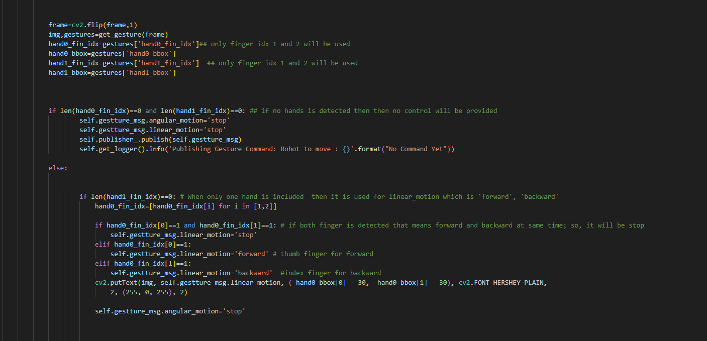

# Team D SME Lab Final Project: Akash Ghimire(12194814) Contribution

## Node Architecture

<div align="center">
  
</div>

- `img_topic`: Camera Node publishes image data -> Gesture Node subscribes and receives image data.


- `ges_topic`: Gesture Node publishes gesture information -> Gesture Control Node subscribes and receives gesture information.


- `ges_control_topic`: Gesture Control Node publishes control commands which is later subscribe by turtlesim node to control node 

## Packages Description

I have created 4 packages in which two are for exchange of ROS2 topics while other two consist of subscriber and publisher executables.  They are described below. 


| Package         | Description |
| --------------- | ----------- |
| `cam_interface` | Consists of `CamTopic.msg`. Used by Camera Node to publish Image. |
| `gest_interface`| Consists of `GestureTopic.msg`. Used by Gesture Node to publish gesture control messages. |
| `cam_pub_sub`   | `cam_pub`: Used to publish Image Data. Useful for applications on similar topics like Gesture Control, Emotion Recognition.<br>`cam_sub`: To test the publisher.<br>`launch_file`: For launching both publisher and subscriber. |
| `gesture_pub_sub` | `ges_pub`: Receives image using `cam_sub` and publishes gesture control on Gesture Topic.<br>`ges_sub`: Subscribes to `GestureTopic` message and publishes `Twist` message to control the robot. |


> A detailed discription is provided on presentation and google slides. 


# Project Requirement

-  ## ✓ Launch files (snipshot) : Two Launch files:

**gesture_pub_sub launch files**


**cam_pub_sub launch files**


- ## ✓ Bag files (for recording) - mandatory


- ## ✓ Using Advanced CLI with click library in Python - mandatory


- ##  ✓ At least two ROS functions for each member - mandatory (2 interface packages and 4 ros functionality)

I have built four packages: [Click Here](/12194814_ros_ws/src/)

  [cam_interface](/12194814_ros_ws/src/cam_interface) and [gesture_interface](/12194814_ros_ws/src/gesture_interface) consist of `CamTopic` and `GestureTopic` used by [cam_pub_sub](/12194814_ros_ws/src/cam_pub_sub) and [gesture_pub_sub](/12194814_ros_ws/src/gesture_pub_sub) packages.

  Under [gesture_pub_sub](/12194814_ros_ws/src/gesture_pub_sub) package there are two ros_functionality: 
  [gesture_pub_sub](/12194814_ros_ws/src/gesture_pub_sub/gesture_pub_sub/ges_pub.py) and 
  [gesture_pub_sub](/12194814_ros_ws/src/gesture_pub_sub/gesture_pub_sub/ges_sub_turtlesim.py) 

  Under [cam_pub_sub](/12194814_ros_ws/src/cam_pub_sub) package there are two ros_functionality: 
  [cam_pub_sub](/12194814_ros_ws/src/cam_pub_sub/cam_pub_sub/cam_pub.py) and 
  [cam_pub_sub](/12194814_ros_ws/src/cam_pub_sub/cam_pub_sub/cam_sub.py) 

    **In total I have two interfaces, and four ROS functionality.**


- ## ✓ Well-commented codes - mandatory



- ## ✓ Using Test scenarios - mandatory


## How to use ros_ws?

1. Install requirements such as : `tensorflow,numpy,opencv-python,mediapipe,cvzone`. In order to open it run the following commands: 
```bash
pip install -r requirements.txt
```

2. Change to workspace directory and run colcon build and source them. 
```bash
cd 12194814_ros_ws
colcon build
```

```bash
source install/setup.bash
```

3. Running `camera_publisher`
```bash
source install/setup.bash
ros2 run cam_pub_sub cam_pub
```

in other terminal run: 
```bash
source install/setup.bash
ros2 run cam_pub_sub cam_pub
```
Using this, you can verify the working of the cam publisher. 

4. Running `gesture_publisher` and `dummy_subscriber`

```bash
source install/setup.bash
ros2 run gesture_pub_sub gesture_publisher
```

in other terminal run: 
```bash
source install/setup.bash
ros2 run gesture_pub_sub gesture_subscriber
```

5. Opening `launch` file to control `turtlebot in sumulation`:
```bash
source install/setup.bash
ros2 launch gesture_pub_sub gesture_turtlesim_launch.py
```

5. `rosbag2 play`
ros2 bag play <path_to_bag_file>
```bash
cd 12194814_ros_ws
ros2 bag play rosbag2_2023_12_04-14_32_36
```
We had recorded the movement of turtlesim robot(which twist message was published by Gesture_Control_Node), so open `turtlesim_node` to verify this 

```bash
ros2 run turtlesim turtlesim_node
```

## Detailed Explanation

This has been detailly explained on a video presentation which will be submitted by team mates. Or, you can play it from


1. [Demo 1](https://www.youtube.com/watch?v=NtJKkORPFKY&ab_channel=AKASHGHIMIRE)
2. [Demo 2](https://www.youtube.com/watch?v=rDadLp9oBMs&ab_channel=AKASHGHIMIRE)
3. [Demo 3](https://www.youtube.com/watch?v=IUQ8O125wrE&ab_channel=AKASHGHIMIRE)
4. [Demo 4](https://www.youtube.com/watch?v=wnw1mWM6HAQ&ab_channel=AKASHGHIMIRE)

## [Detailed Explanation video: Click Here](https://drive.google.com/file/d/1IRBk5U86LYMGRNqeZW3ha30SwS_quU9d/view?usp=sharing)

## [Detailed Explanation PPT: Click Here](https://docs.google.com/presentation/d/1oz1VikWWInwmaPT3qQgrkYjFS0kgqzyMJ2SVUK5Xpe0/edit?usp=sharing)


The final presentation will be submitted on Iclass.